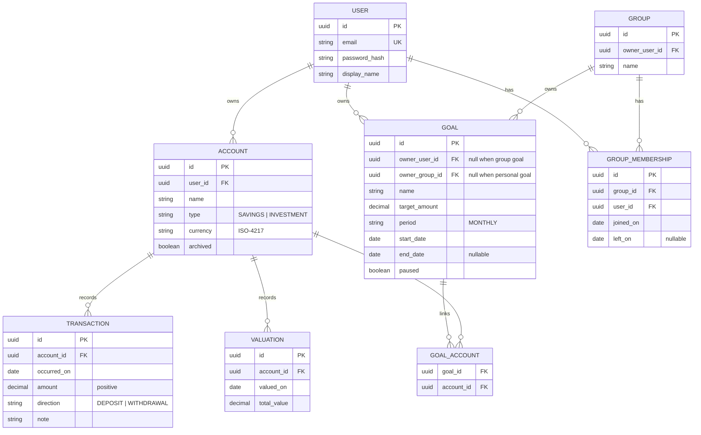

# Domain model

Entities, their relationships and the rules that must always hold. Vocabulary is defined
in [glossary.md](../product/glossary.md); behaviour is specified in
[requirements.md](../product/requirements.md).

## Entities

## Invariants

These must hold at all times; each should have a test. They are enforced in aggregate
factories (`create`), never validated after the fact; see
[guidelines/domain-modelling.md](../guidelines/domain-modelling.md).

**Account**

1. An account belongs to exactly one user and never changes owner.
2. An account's currency is set at creation and is immutable.
3. An archived account accepts no new transactions or valuations.

**Transaction**

4. `amount` is strictly positive; direction carries the sign.
5. A transaction's currency is its account's currency — it is never specified separately.
6. Transactions may be back-dated, but calculations key on `occurred_on`, never on the
   creation timestamp.

**Valuation**

7. Valuations exist only on `INVESTMENT` accounts.
8. At most one valuation per (account, `valued_on`).
9. `total_value` is zero or positive.

**Goal**

10. A goal has exactly one owner: either a user or a group, never both and never neither.
11. Every account linked to a personal goal is owned by the goal's owner.
12. Every account linked to a shared goal is owned by a current member of that group.
13. All accounts linked to one goal share a currency (see requirements §9, question 1).
14. `end_date`, when set, is after `start_date`.

**Group**

15. A group always has an owner, and the owner is a current member.
16. A user has at most one active membership (`left_on is null`) per group.
17. Deleting a group deletes memberships and shared goals, never accounts or transactions.

## Derived calculations

None of these are stored.

| Value | Applies to | Rule |
|---|---|---|
| **Balance** | Savings account | Σ deposits − Σ withdrawals with `occurred_on <= date` |
| **Current value** | Investment account | `total_value` of the valuation with the greatest `valued_on <= date`; *unknown* if none |
| **Net contributions** | Any account | Σ deposits − Σ withdrawals within the period |
| **Return** | Investment account | current value − net contributions since the account's start |
| **Contributed** | Goal, per period | Σ deposits − Σ withdrawals on linked accounts within the period |
| **Period met** | Goal, per period | contributed ≥ `target_amount` |
| **Shared goal progress** | Group goal, per period | Σ contributed across all linked accounts of all members |

## Deliberate omissions

- No holdings, instruments or prices inside an investment account — only total value.
- No currency conversion, and therefore no exchange-rate entity.
- No audit log beyond the entities themselves in v1.
