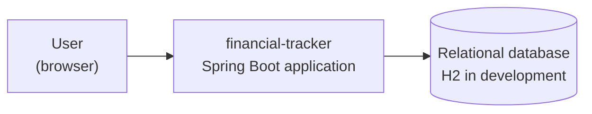
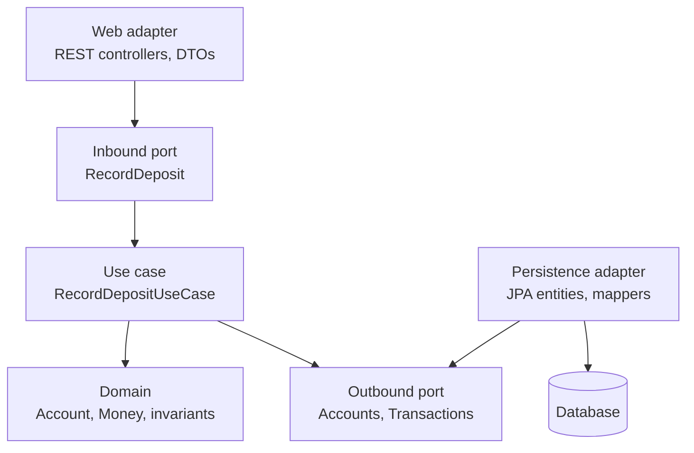

# Architecture overview

Describes how the system is built **today**. When something changes, this document changes
with it — it is not a history. Reasoning behind decisions lives in [../adr/](../adr/);
the rules contributors follow live in
[../guidelines/architecture-principles.md](../guidelines/architecture-principles.md).

## Context



There are no external systems. No bank, broker or payment provider is integrated, now or
later (see [requirements NFR-1](../product/requirements.md#7-non-functional-requirements)).

## Technology

| Concern | Choice |
|---|---|
| Language | Java 26 |
| Framework | Spring Boot 4.1 |
| Web | Spring Web MVC, JSON REST endpoints |
| Persistence | Spring Data JPA / Hibernate |
| Schema | Flyway migrations (`src/main/resources/db/migration`) |
| Database | H2 in development; a server database to be decided before deployment |
| Build | Maven (`./mvnw`) |
| Tests | JUnit 5, AssertJ, Spring test slices, ArchUnit |

## Shape: a hexagon per feature slice

The application is **ports and adapters** ([ADR-0001](../adr/0001-hexagonal-architecture-with-use-case-slices.md)).
The domain is plain Java with no framework dependencies; use cases orchestrate it behind
inbound ports; adapters implement outbound ports.



Dependencies point inward only. Nothing in `domain` or `application` imports Spring, JPA,
HTTP or SQL — enforced by an ArchUnit test, not by review alone. Aggregates are plain Java
with separate JPA entities in the persistence adapter
([ADR-0002](../adr/0002-domain-free-of-jpa-annotations.md)), and are built through
`create` (new) or `hydrate` (reconstitution from storage)
([ADR-0003](../adr/0003-split-aggregate-creation-into-create-and-hydrate.md)).

## Package structure

Feature first, hexagon inside:

```
se.financial_tracker
├── account      accounts, transactions, valuations
├── goal         goals and progress calculation
├── group        groups, memberships, shared goals
├── user         registration, authentication, profile
└── common       Money and shared value objects, error handling, configuration
```

Each slice contains `domain`, `application/{port/in,port/out,usecase}` and
`adapter/{in/web,out/persistence}`. Slices talk to each other through inbound ports only.
The full rules, with a worked example, are in
[../guidelines/architecture-principles.md](../guidelines/architecture-principles.md).

## Derived values

Balances, current values, net contributions, returns and goal progress are **never
stored** — they are computed from transactions and valuations on read
([NFR-4](../product/requirements.md#7-non-functional-requirements)). This keeps stored data
free of figures that can drift out of sync with the facts they came from. If reads become
slow, caching is added deliberately and documented here; the calculation stays the source
of truth.

## Money

Amounts are a `Money` value object — `BigDecimal` plus an ISO-4217 currency code — living
in `common`. Stored as `DECIMAL(19,4)` plus a `CHAR(3)` currency column. Each account has
one currency; the application never converts between currencies.

## Not yet decided

- Authentication mechanism (session vs token) and whether Spring Security is introduced now
- How use case beans are wired: Spring `@Configuration` factories vs `@Component`
  (postponed deliberately — see architecture principles §9)
- Production database and hosting
- Whether the front end is server-rendered or a separate client application

Each becomes an ADR once settled.
