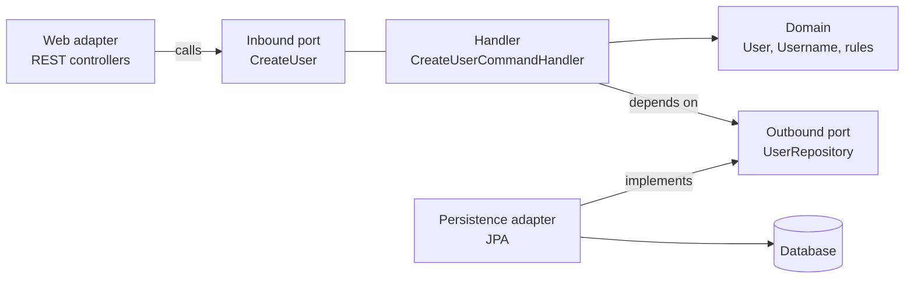

# Architecture principles

How we structure code. The four commitments below are deliberate and apply to every
feature; everything else in this document follows from them.

1. **Hexagonal architecture (ports and adapters)** — the domain sits in the middle and
   knows nothing about HTTP, JPA or Spring. Everything technical plugs into it.
2. **Domain-Driven Design** — the model uses the language in
   [glossary.md](../product/glossary.md), and business rules live in the domain objects,
   not in services that push data around.
3. **SOLID** — see [§5](#5-solid-applied-here) for what each letter means *here*.
4. **Use-case-driven slicing** — the application layer is a set of named commands and
   queries, each with its own handler (`CreateUserCommandHandler`,
   `RecordDepositCommandHandler`), not generic `AccountService` classes that accumulate
   every operation touching an account.

## 1. The dependency rule

Dependencies point **inward only**. The domain depends on nothing. The application layer
depends on the domain. Adapters depend on the application layer's ports. Nothing inside
ever imports anything outside.



Concretely, in `domain`, `commands`, `queries` and `port` you will not find: `@Entity`,
`@RestController`, `@Repository`, `javax`/`jakarta.persistence`, `HttpServletRequest`,
Jackson annotations, or SQL. `@Transactional` is the one pragmatic exception — see
[§6](#6-practices).

Inward-only is enforced by the build: `core` cannot see Spring, JPA or the servlet API at
all ([ADR-0005](../adr/0005-adapters-as-separate-maven-modules.md)). What the compiler
cannot see — slice isolation, `hydrate`, handlers implementing a port — is covered by an
ArchUnit test; see [testing-strategy.md](testing-strategy.md).

## 2. Package structure

Slice by **feature first**, then by hexagon layer. Everything about one concept lives
together, and each slice has the same internal shape:

```
se.financial_tracker
├── user
│   ├── domain                     User, Username, invariants
│   ├── commands                   CreateUserCommand + CreateUserCommandHandler
│   ├── queries                    GetUserQuery + GetUserQueryHandler, read models
│   └── port
│       ├── in                     CreateUser, GetUser (interfaces the handlers implement)
│       └── out                    UserRepository (interfaces the adapters implement)
├── account                        accounts, transactions, valuations
├── goal
├── group
└── common
    └── domain                     Money, TypedString/TypedUuid primitives, shared value objects
```

Those slices are packages in the **`core` Maven module**. Adapters live in modules of
their own that depend on `core`
([ADR-0005](../adr/0005-adapters-as-separate-maven-modules.md)):

```
core                  the slices above — no Spring, no JPA, no web library
adapter-web           REST controllers, request/response DTOs        → depends on core
adapter-persistence   JPA entities, Spring Data repositories, mappers → depends on core
app                   Spring Boot application, configuration, wiring  → depends on all
```

`core` has no framework on its classpath, so the dependency rule is a **compile error**
rather than a convention: a domain class cannot import `@Entity` even by accident.

Rules:

- A slice may depend on **another slice's inbound ports only** — never on its domain, its
  handlers, or its persistence. Cross-slice access goes through a port like any other
  collaborator.
- Classes are **package-private by default**. Only ports, commands, queries, results and
  domain types that other slices legitimately need are `public`.
- `common` holds genuinely shared types and mirrors the same internal shape
  (`common/domain`). If something is used by one slice, it belongs to that slice. `common`
  is not a junk drawer.

## 3. Commands, queries and their handlers

**One operation = one command or query = one handler = one public method.** This is the
heart of the slicing commitment: the class names in `commands/` and `queries/` are the
list of things the application can do, readable at a glance.

Writes live in `commands/`, reads in `queries/`. Each handler implements a small inbound
port so that adapters and other slices depend on an interface rather than on the handler
itself.

```java
// port/in — what the outside world may ask for
public interface RecordDeposit {
    TransactionId handle(RecordDepositCommand command);
}

// commands — the input, validated where it is defined
public record RecordDepositCommand(
        AccountId accountId,
        UserId requestedBy,
        Money amount,
        LocalDate occurredOn,
        String note) {

    public RecordDepositCommand {
        requireNonNull(accountId, "accountId");
        if (amount.isNotPositive()) {
            throw new IllegalArgumentException("amount must be positive");
        }
    }
}

// commands — the orchestration, and only the orchestration
public final class RecordDepositCommandHandler implements RecordDeposit {

    private final Accounts accounts;          // outbound port
    private final Transactions transactions;  // outbound port

    public RecordDepositCommandHandler(Accounts accounts, Transactions transactions) {
        this.accounts = accounts;
        this.transactions = transactions;
    }

    @Override
    public TransactionId handle(RecordDepositCommand command) {
        Account account = accounts.byId(command.accountId())
                .orElseThrow(() -> new AccountNotFound(command.accountId()));

        account.assertOwnedBy(command.requestedBy());     // authorization is a domain rule
        Transaction deposit = account.deposit(command.amount(), command.occurredOn(), command.note());

        return transactions.save(deposit).id();
    }
}
```

Conventions:

- Name the operation after **what the user does**, in the imperative: `RecordDeposit`,
  `ArchiveAccount`, `InviteMemberToGroup`. Never `AccountManagementService`.
- The inbound port carries that name; the command and handler add the suffix —
  `RecordDeposit` / `RecordDepositCommand` / `RecordDepositCommandHandler`. Queries follow
  the same shape: `GetUser` / `GetUserQuery` / `GetUserQueryHandler`.
- The single public method is `handle(...)`.
- Commands and queries are records, validated in their compact constructor. Output is a
  plain record or an identifier — never a JPA entity, never a DTO shaped for one screen.
- The handler **orchestrates**: load, delegate to the domain, save. Business rules that
  are visible in the code of a handler usually belong in an aggregate instead.
- Query handlers may bypass the domain and return read models straight from a query port.
  This is intentional (CQRS-lite): it keeps dashboards fast without distorting the model.
  Commands never take that shortcut.

## 4. Ports

|                |              Inbound (driving)              |                       Outbound (driven)                        |
|----------------|---------------------------------------------|----------------------------------------------------------------|
| Who calls      | Web adapter, scheduler, other slices, tests | The handler                                                    |
| Who implements | The command or query handler                | Persistence adapter, clock, etc.                               |
| Lives in       | `<slice>/port/in`                           | `<slice>/port/out`                                             |
| Named after    | The action: `RecordDeposit`                 | The need, in domain terms: `Accounts`, `Transactions`, `Clock` |

- Ports are owned by the **inside**. An outbound port describes what the domain needs, in
  the domain's language — not what JPA offers. `Accounts.byId(...)`, not
  `AccountJpaRepository.findById(...)`.
- Keep ports **narrow** (Interface Segregation). A handler that only reads accounts should
  not be able to delete them. Several small ports beat one repository interface with
  twenty methods.
- Ports return **domain types**, never persistence entities.

Aggregates, value objects, invariants and the `create`/`hydrate` split are covered in
[domain-modelling.md](domain-modelling.md).

## 5. SOLID applied here

|                           |                                                           Meaning in this codebase                                                            |
|---------------------------|-----------------------------------------------------------------------------------------------------------------------------------------------|
| **S**ingle responsibility | One handler does one thing. A class needing "and" in its description is two classes.                                                          |
| **O**pen/closed           | New behaviour arrives as a new handler or a new adapter, not as another `if` branch in an existing one.                                       |
| **L**iskov substitution   | Any adapter implementing a port must honour its contract — including a fake used in tests. If the fake needs to lie, the port is wrong.       |
| **I**nterface segregation | Narrow ports (§4). No "God repository" — `UserRepository` grows a method only when a handler needs it.                                        |
| **D**ependency inversion  | The inside defines the interfaces; the outside implements them. This *is* the hexagon — DIP is the principle the whole architecture rests on. |

## 6. Practices

- **Constructor injection only.** No `@Autowired` fields, no field or setter injection.
  Domain classes and handlers must be constructible in a test with `new`.
- **Wire in configuration, not annotations.** Handlers are registered as beans in a Spring
  `@Configuration` class in the `app` module, since `core` has no Spring on its classpath
  to annotate them with. (A `@Component` on the handler is the pragmatic alternative.
  **This decision is postponed** — see [§8](#8-decisions-still-open) — so match the
  existing slices rather than choosing anew.)
- **Transaction boundary is the handler.** `@Transactional` sits on the handler class.
  This is the one Spring annotation allowed inward, and it is a conscious trade-off.
- **Immutability by default.** Records for commands, results and value objects. Mutable
  state only inside aggregates, and only where the domain genuinely changes.
- **Validation twice, for different reasons.** The web adapter rejects malformed input
  (missing field, unparseable date). The domain rejects invalid *business* states (deposit
  on an archived account). Neither replaces the other.
- **Time is a port.** Never call `LocalDate.now()` in domain or handler code; inject a
  clock. Period-boundary bugs are otherwise untestable.
- **The domain has no JPA.** Aggregates are plain Java; separate JPA entities live in the
  persistence adapter ([ADR-0002](../adr/0002-domain-free-of-jpa-annotations.md)). There
  is no dirty checking on domain objects, so a handler explicitly saves what it changed.
- **Mapping is explicit.** Hand-written mappers between JPA entities and domain objects.
  No mapping framework, no shared class doing double duty. Mappers use `hydrate` on the
  way in and read state on the way out.
- **Derived values are computed, not stored** (see
  [architecture/overview.md](../architecture/overview.md)).
- **Money never touches `double`.** `Money` is `BigDecimal` + currency, and only `Money`
  crosses layer boundaries.
- **Don't abstract on speculation.** A port with exactly one implementation and no test
  fake is often just indirection. Add the seam when a second reason to change appears.

## 7. Smells we reject

- `*Service` classes that grow one method per endpoint
- A handler with more than one public method, or a command reused by two handlers
- JPA entities used as domain objects, DTOs, or API responses
- `Optional` fields, or returning `null` from a port
- Business rules inside controllers, mappers, or database queries
- Static access to the current time, user or transaction
- `common` or `util` packages that everything depends on
- Comments explaining what code does instead of naming things properly

## 8. Decisions still open

- **TODO — bean wiring. Postponed deliberately.** Spring `@Configuration` factories (keeps
  the inside Spring-free) vs `@Component` on handlers (less ceremony). Until this is
  decided, follow whatever the existing slices do and do not introduce a third way;
  revisit once the first few slices exist. Listed under *Postponed* in [../adr/](../adr/).
- **TODO — read models.** How far to take the CQRS-lite escape hatch in §3 before it needs
  its own structure.
- **TODO — slice isolation.** Keeping technology out of `core` is settled by
  [ADR-0005](../adr/0005-adapters-as-separate-maven-modules.md); slices policing *each
  other* inside `core` is not. ArchUnit only, or Spring Modulith once the slices settle.

